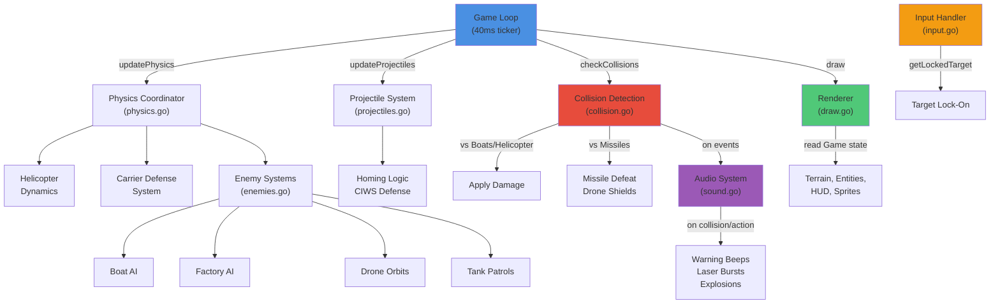

# Gobungle Architecture

Gobungle is a terminal-based helicopter combat simulation built with Go and the `tcell` library. This document outlines the high-level design, core systems, and gameplay mechanics.

## Design Philosophy

The goal of Gobungle is to provide a responsive, physics-driven combat experience within the constraints of a text-based terminal. It prioritizes "feel" through momentum-based flight and structured game loops.

### The "What" and the "Why"

- **What:** A 2D top-down "shmup" where you defend an aircraft carrier from swarms of enemy boats.
- **Why TUI (Terminal UI):** To create a low-overhead, highly accessible game that uses ASCII/Unicode characters for stylized retro aesthetics.
- **Why Decoupled Loops:** The game separates physics updates (fixed 25 FPS) from rendering and input to ensure consistent movement regardless of system performance.

## Core Systems

The game engine coordinates seven tightly-coupled subsystems within the `Game` struct:



### 1. Helicopter Flight System
The helicopter operates on a momentum-based physics model.
- **Momentum:** Thrust applies acceleration in the current facing direction. Low drag ensures smooth "sliding" movement.
- **Fuel Management:** Airborne operations consume fuel. Running out results in an engine failure and a potential ocean crash.
- **Landing/Takeoff:** A dedicated mechanic for interacting with the carrier to repair, refuel, and rearm.

### 2. Carrier Operations
The aircraft carrier is the player's home base and primary defense objective.
- **Defense:** If the carrier's health reaches zero, the round is lost.
- **Support:** Landing on the carrier pad provides automated refueling, armor repairs, and missile restocking.

### 3. Combat System
- **Aerial Cannon:** Short-range, high-rate-of-fire unguided projectiles.
- **Guided Missiles:** Long-range homing weapons requiring a lock-on within a +/- 45° forward aperture.
- **Enemy AI:** Boats sail across the water, firing AA flak at the player and guided missiles at the carrier.
- **CIWS (Close-In Weapon System):** Boats have a chance to intercept player missiles, adding a layer of tactical depth.

### 4. World Physics & Mechanics
- **Collision Detection:** Uses rectangular hitboxes for boats and circular/point hitboxes for the helicopter and projectiles.
- **Progressive Difficulty:** Each time a fleet of boats is destroyed, the next wave respawns with increased movement speed.
- **Visual Effects:** Procedural explosions and rotor animations enhance the feedback loop.

### 5. Audio System
- **Sound Synthesis:** Procedurally generated audio effects using `tcell.Speaker` at 44.1 kHz.
- **Sound Effects:** Warning beeps (incoming missiles), laser bursts (cannon fire), missile whooshes (launches), and explosions (wave completion, impacts).
- **Rate Limiting:** Prevents audio clipping during intense combat by rate-limiting identical sounds to once per 60ms.
- **Graceful Fallback:** Disables audio if speaker initialization fails, allowing silent-mode gameplay.

## Realized Architecture: Modular Subsystems

The engine has been refactored toward **Option 4 (Modular Interface-Driven Composition)**, organizing code by responsibility within a single `internal/game` package:

### Current Structure

```
internal/game/
├── game.go           — Game struct, New(), Run(), gameLoop(), inputLoop()
├── types.go          — Entity types, direction vectors, sprite data
├── physics.go        — Physics coordinator, helicopter, carrier defense, wave progression
├── enemies.go        — Boat, factory, drone, tank, static AA AI and movement
├── projectiles.go    — Bullet/missile movement, homing logic, CIWS countermeasures
├── collision.go      — All collision detection and damage resolution
├── input.go          — Keyboard input handling, target lock-on calculation
├── draw.go           — Rendering pipeline, HUD, sprite animations
└── sound.go          — Audio synthesis, sound effects, rate limiting
```

**Why This Approach Works:**
- **Low Coupling:** Each subsystem is a cohesive set of methods on `*Game`. No shared state outside the struct.
- **Minimal Disruption:** The `Game` struct remains the "hub," but its responsibilities are logically partitioned. Physics code is isolated from input handling, which is isolated from collision logic.
- **Testability:** Individual subsystems like `homeMissileToTarget()` or `checkPlayerBulletVsTargets()` can be tested in isolation by constructing a `Game` with test state and calling methods directly.
- **Separation of Concerns:**
  - `physics.go`: Entity dynamics, world simulation, wave progression
  - `enemies.go`: Enemy AI and movement, independent from player systems
  - `projectiles.go`: Pure movement, homing steering, CIWS logic
  - `collision.go`: Hit detection, damage resolution, sinking sequences
  - `input.go`: User commands, target lock-on calculation
  - `draw.go`: Rendering only; reads game state, no mutations
  - `sound.go`: Audio synthesis and playback; triggered by collision and action events

### Pointer Aliasing and Lock-On Targets

The `Game` struct caches pointers to locked targets:
```go
lockedBoat     *Boat
lockedFactory  *Factory
lockedTank     *Tank
lockedStaticAA *StaticAA
```

These are updated once per tick at the end of `updatePhysics()` via `getLockedTarget()`. This avoids repeated scan-and-filter operations during collision or weapon-firing checks. The pointers remain valid because the entity slices (`g.boats`, `g.factories`, etc.) never shrink in the middle of a tick—only at wave completion or round reset.

### Future Scaling Paths

If the game grows beyond ~50 entities, consider:

#### 1. Entity Component System (ECS)
- **When:** After 100+ entities or complex multi-role compositions (e.g., a boat that can also be a repair ship).
- **Trade-off:** Significant rewrite, but enables dynamic entity behaviors and cache-friendly loops.
- **Porting Effort:** Very High.

#### 2. Event Bus + Async Systems
- **When:** Multiple independent systems need to react to collisions (audio, particles, score, loot drops).
- **Example:** Publish `CollisionEvent`, let particle system and score system subscribe independently.
- **Trade-off:** Better decoupling, but requires careful state synchronization.
- **Porting Effort:** High.

#### 3. Functional / Immutable State
- **When:** Replay, rewind, or deterministic network multiplayer is required.
- **Trade-off:** Eliminates side-effect bugs, but GC pressure from state cloning.
- **Porting Effort:** Medium to High.

#### 4. Multi-threaded Physics (Work-stealing)
- **When:** Physics tick time exceeds ~10ms on typical hardware.
- **Example:** Partition entity updates by grid cell, run cell systems in parallel.
- **Trade-off:** Reduces latency but adds complexity around concurrent collision detection.
- **Porting Effort:** High.

**Current Status:** The modular subsystem approach is sufficient for the game's current scope and provides a clear ladder for future refactoring without rewriting the entire engine.

## Implementation Reference

For detailed code-level documentation and visual diagrams, see:

- **[IMPL.md](./IMPL.md)** — High-level module overview, module flow, and implementation specifics of each subsystem.
- **[internal/game/IMPL.md](./internal/game/IMPL.md)** — Deep dive into code organization, data flow, threading model, difficulty progression, HUD display, audio system, and world layout.
- **[internal/game/DIAGRAMS.md](./internal/game/DIAGRAMS.md)** — Nine Mermaid control-flow diagrams covering the game loop, physics pipeline, helicopter state machine, input routing, target lock acquisition, collision dispatch, projectile lifecycle, and wave progression.
