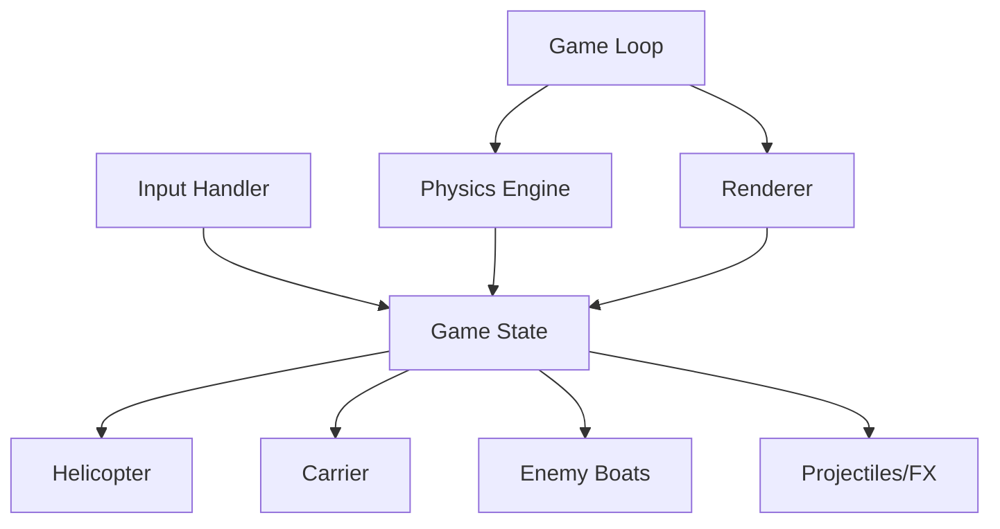

# Gobungle Architecture

Gobungle is a terminal-based helicopter combat simulation built with Go and the `tcell` library. This document outlines the high-level design, core systems, and gameplay mechanics.

## Design Philosophy

The goal of Gobungle is to provide a responsive, physics-driven combat experience within the constraints of a text-based terminal. It prioritizes "feel" through momentum-based flight and structured game loops.

### The "What" and the "Why"

- **What:** A 2D top-down "shmup" where you defend an aircraft carrier from swarms of enemy boats.
- **Why TUI (Terminal UI):** To create a low-overhead, highly accessible game that uses ASCII/Unicode characters for stylized retro aesthetics.
- **Why Decoupled Loops:** The game separates physics updates (fixed 25 FPS) from rendering and input to ensure consistent movement regardless of system performance.

## Core Systems

### 1. Helicopter Flight System
The helicopter operates on a momentum-based physics model.
- **Momentum:** Thrust applies acceleration in the current facing direction. Low drag ensures smooth "sliding" movement.
- **Fuel Management:** Airborne operations consume fuel. Running out results in an engine failure and a potential ocean crash.
- **Landing/Takeoff:** A dedicated mechanic for interacting with the carrier to repair, refuel, and rearm.

### 2. Carrier Operations
The aircraft carrier is the player's home base and primary defense objective.
- **Defense:** If the carrier's health reaches zero, the round is lost.
- **Support:** Landing on the carrier pad provides automated refueling, armor repairs, and missile restocking.

### 3. Combat System
- **Aerial Cannon:** Short-range, high-rate-of-fire unguided projectiles.
- **Guided Missiles:** Long-range homing weapons requiring a lock-on within a +/- 45° forward aperture.
- **Enemy AI:** Boats sail across the water, firing AA flak at the player and guided missiles at the carrier.
- **CIWS (Close-In Weapon System):** Boats have a chance to intercept player missiles, adding a layer of tactical depth.

### 4. World Physics & Mechanics
- **Collision Detection:** Uses rectangular hitboxes for boats and circular/point hitboxes for the helicopter and projectiles.
- **Progressive Difficulty:** Each time a fleet of boats is destroyed, the next wave respawns with increased movement speed.
- **Visual Effects:** Procedural explosions and rotor animations enhance the feedback loop.
