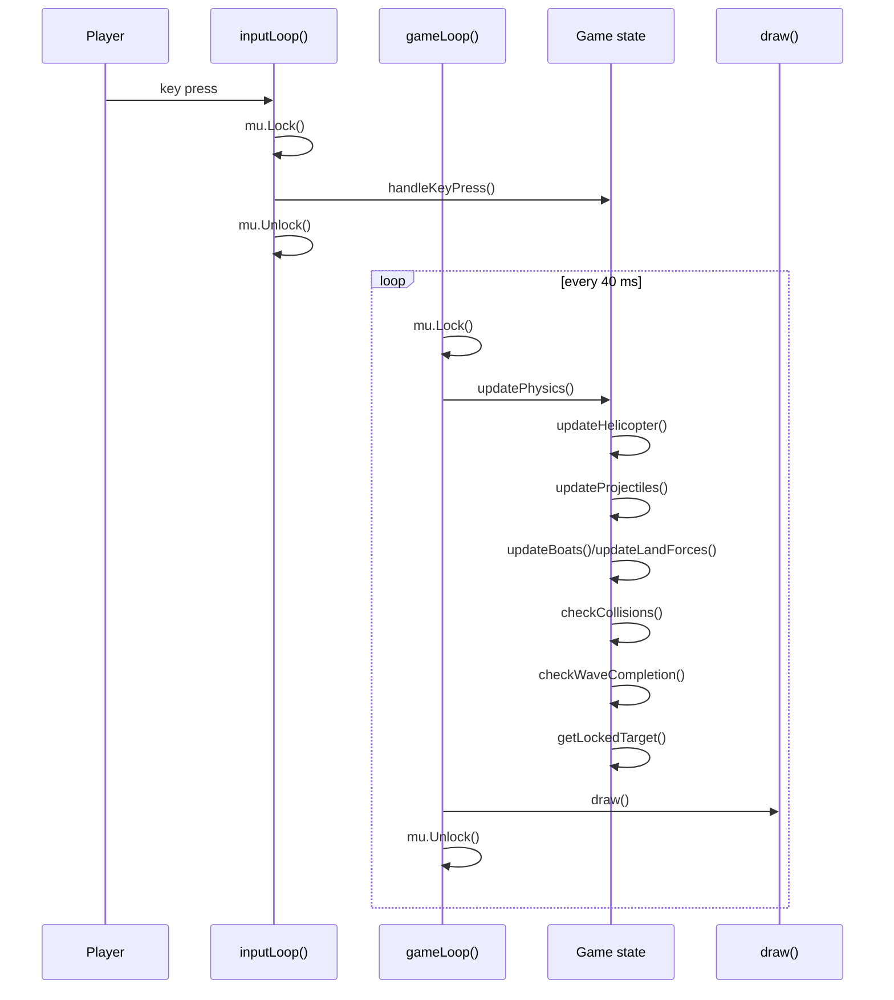
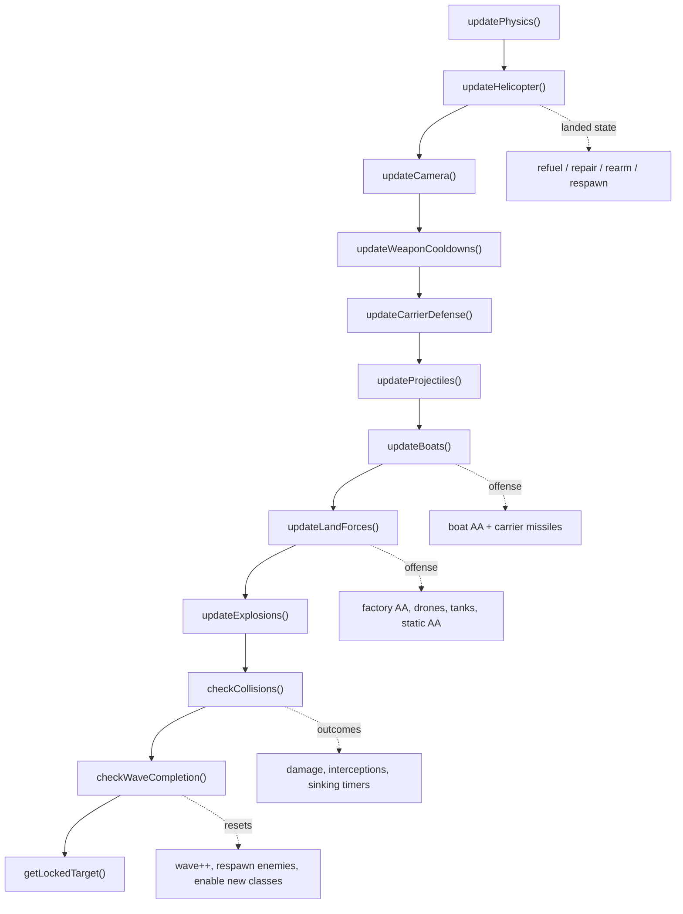
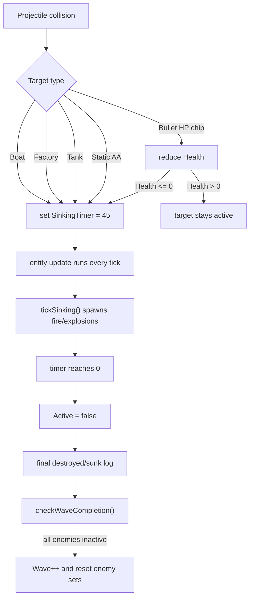

# Gameplay From The Last Logged Session

This document explains how the game implementation behaves by walking through the
last recorded session in `gobungle.log` and mapping the visible events back to
the runtime code in [internal/game/game.go](./internal/game/game.go),
[internal/game/input.go](./internal/game/input.go),
[internal/game/physics.go](./internal/game/physics.go),
[internal/game/enemies.go](./internal/game/enemies.go),
[internal/game/projectiles.go](./internal/game/projectiles.go), and
[internal/game/collision.go](./internal/game/collision.go).

## Scope

- Session start: `2026-06-03 10:16:13.900 -04:00`
- Session end: `2026-06-03 10:20:33.649 -04:00`
- Duration: about 4m 20s
- Outcome: the player cleared wave 1, cleared wave 2, triggered wave 3, saw
  static AA activate, then quit.

## Session At A Glance

| Time window | What the log shows | What the implementation is doing |
| --- | --- | --- |
| `10:16:13` | Game start, audio init, static AA placement, resize | `New()` builds the world, `initStaticAAs()` places 6 guns, `Run()` starts input + ticker loops |
| `10:16:15` to `10:16:37` | Takeoff, 4 guided missiles, 3 boats sunk | Player input spawns bullets/missiles; boats die through `SinkingTimer = 45`; wave 1 boats are removed in `updateBoats()` |
| `10:16:53` to `10:16:59` | Auto-land, missile rearm, refuel, takeoff | `updateHelicopter()` enters landed service mode and restores the helicopter |
| `10:17:07` to `10:17:28` | Factory AA, drone interception, all 3 factories destroyed, wave advances to 2 | Factories fire in `updateFactories()`, drones intercept in `checkDroneMissileInterceptions()`, `checkWaveCompletion()` increments `Wave` |
| `10:17:47` to `10:17:58` | Auto-land, repairs complete, boats launch missiles at carrier | Same landed service loop; wave 2 boats have respawned and resumed offense |
| `10:18:00` to `10:18:20` | Cannon burst, manual enemy missile interception, 3 more boats sunk | Wave 2 boats are cleared; lock-on failures show the forward-aperture missile gate |
| `10:18:40` to `10:18:46` | Auto-land, missile rearm, carrier drone restored | `replenishCarrierDrones()` runs only while landed and only on `Ticks % 100 == 0` |
| `10:18:55` to `10:20:24` | Factories + tanks engage, heli is destroyed once, respawns, tanks die, wave advances to 3 | Wave 2 mixed-forces logic: factories, drones, tanks, collisions, respawn timer, then wave reset |
| `10:20:27` to `10:20:29` | Static AA fires and is hit by cannon | Static AA becomes active only after wave 3 reset (`Wave >= 3`) |

## Session Counters

These are counts of log messages in the last session, not physics ticks.

| Event | Count |
| --- | ---: |
| `Aerial cannon fired` | 80 |
| `Guided missile fired` | 19 |
| `Enemy projectile hit Player` | 16 |
| `Boat fired anti-aircraft projectile` | 10 |
| `Factory fired fortress anti-aircraft projectile!` | 25 |
| `Tank fired flak projectile!` | 19 |
| `Static AA fired flak projectile!` | 4 |
| `Player guided missile hit Boat - delayed sinking initiated!` | 6 |
| `Player guided missile hit Factory (CRITICAL HIT!)` | 5 |
| `Player guided missile hit Tank (CRITICAL HIT!)` | 2 |
| `Doomed boat has fully sunk` | 6 |
| `Enemy military Factory has been completely destroyed!` | 6 |
| `Patrolling Tank has fully blown up!` | 3 |
| `All enemy assets destroyed! Advancing to next wave` | 2 |
| `Auto-landed on carrier pad` | 3 |
| `Takeoff initiated` | 5 |
| `Helicopter destroyed` | 1 |

## 1. The Runtime Loop Behind The Logs

The log stream only makes sense if you read it as two cooperating loops:

- `inputLoop()` blocks on terminal events and mutates game state under the mutex.
- `gameLoop()` runs every `40ms` and owns physics plus rendering.



That explains why some log lines are immediate user actions (`Takeoff initiated`,
`Aerial cannon fired`) while others only appear after one or more physics ticks
(`Doomed boat has fully sunk`, `Enemy military Factory has been completely destroyed!`).

## 2. Per-Tick Order That Generates Combat

`updatePhysics()` is the actual gameplay pipeline. The order matters:



Two important consequences show up directly in the session:

1. Missile lock is refreshed last, so lock-dependent launches can fail until the
   end-of-tick target scan catches up to the new heading/position.
2. Wave transitions happen after collisions, so newly enabled enemies only start
   logging on later ticks.

## 3. What The Last Session Proves

### Boot And World Setup

The first lines show setup, not combat:

```text
10:16:13.900  Gobungle Game Started
10:16:13.932  Audio system successfully initialized using Beep
10:16:13.932  Initialized static AA gun idx=0..5
10:16:13.937  Screen resized width=211 height=51
```

This matches:

- `cmd/gobungle/main.go`: logger + startup
- `New()`: initial carrier, helicopter, boats, factories, drones, tanks
- `initStaticAAs()`: always places 6 static guns at startup
- `inputLoop()`: logs resize events

The important subtlety is that static AA is initialized at startup but not
necessarily active. On wave 1 and wave 2 those guns exist in memory, but their
`Active` flag stays false until wave 3.

### Wave 1: Boats First

The player takes off and immediately starts the boat-clearing loop:

```text
10:16:15.321  Takeoff initiated
10:16:20.205  Guided missile fired dir=2 ammo_remaining=3
10:16:22.094  CIWS engaged: Boat launched defensive anti-missile countermeasure!
10:16:22.253  Missile successfully dodged enemy anti-aircraft projectile!
10:16:22.414  Player guided missile hit Boat - delayed sinking initiated! boat_idx=1
10:16:24.213  Doomed boat has fully sunk boat_idx=1 total_sunk=1
```

This shows several systems at once:

- `handleKeyPress()` creates the missile.
- `homeMissileToTarget()` picks the nearest active target, not a pre-bound target.
- Boats may roll a one-time CIWS response when the missile enters
  `BoatDetectionRange`.
- Even after a lethal missile hit, the boat does not disappear immediately.
  `checkPlayerMissileVsTargets()` sets `boat.SinkingTimer = 45`, then
  `updateBoats()` owns the delayed death and final log line.

The same pattern repeats for all three boats in wave 1, ending at:

```text
10:16:35.934  Player guided missile hit Boat - delayed sinking initiated! boat_idx=0
10:16:37.733  Doomed boat has fully sunk boat_idx=0 total_sunk=3
```

### Landed Mode Is A Service Station

After the wave 1 boats die, the helicopter drifts back to the carrier and the
log flips from combat to maintenance:

```text
10:16:53.733  Auto-landed on carrier pad x=50 y=26
10:16:53.773  Missiles fully rearmed ammo=4
10:16:58.573  Refueling completed fuel=100
10:16:59.091  Takeoff initiated x=50 y=26
```

This is all inside `updateHelicopter()`:

- auto-landing happens when the heli is aligned over the pad and moving slowly
- rearm is immediate if `MissileAmmo < 4`
- fuel and armor repair are gradual per tick
- takeoff returns to `handleKeyPress()`

The same service loop repeats later, and one landed period also restores a lost
carrier defense drone:

```text
10:18:40.133  Auto-landed on carrier pad
10:18:40.173  Missiles fully rearmed ammo=4
10:18:41.933  Carrier repaired/spawned defensive carrier drone!
10:18:45.293  Refueling completed fuel=100
```

That extra drone log comes from `replenishCarrierDrones()`, which only runs
while landed and only on every 100th tick.

### Factories Are Delayed Kills Too

Wave 1 then shifts from boats to factories:

```text
10:17:10.859  Guided missile fired dir=6 ammo_remaining=3
10:17:11.814  Player guided missile hit Factory (CRITICAL HIT!) idx=0
10:17:13.613  Enemy military Factory has been completely destroyed! idx=0
```

Again, the hit and the final death are separated. The implementation is the
same pattern as boats:

- `checkPlayerMissileVsTargets()` sets `fact.SinkingTimer = 45`
- `updateFactories()` ticks the burning/sinking animation
- the final "completely destroyed" line appears when the timer reaches zero

The player then kills the other two factories in the same way. Once the last
active enemy is gone, the next wave is triggered immediately:

```text
10:17:26.413  Player guided missile hit Factory (CRITICAL HIT!) idx=2
10:17:28.214  Enemy military Factory has been completely destroyed! idx=2
10:17:28.214  All enemy assets destroyed! Advancing to next wave wave=2 speed_multiplier=1.25
```

That final line is `checkWaveCompletion()`. The same function resets boats,
factories, drones, and turns tanks on because `tank.Active = g.Wave >= 2`.

### Lock-On Is Forward-Only And Refreshed At The End Of The Tick

These repeated failures are implementation evidence, not user noise:

```text
10:18:12.546  Missile launch aborted: No target locked within +/- 45 degree forward aperture!
10:18:13.075  Missile launch aborted: No target locked within +/- 45 degree forward aperture!
10:18:13.548  Missile launch aborted: No target locked within +/- 45 degree forward aperture!
10:18:13.973  Guided missile fired dir=1 degrees=45 ammo_remaining=2
```

What this proves:

- the player can only launch if one of `lockedBoat`, `lockedFactory`,
  `lockedTank`, or `lockedStaticAA` is non-nil
- `getLockedTarget()` filters by nearest target inside a `dot >= 0.707` forward
  cone and `MaxLockOnRange`
- the lock is updated at the end of `updatePhysics()`, so turning and launching
  in quick succession can briefly produce aborts

### Wave 2 Adds Mixed Land Defenses And A Real Attrition Loop

Once wave 2 starts, the logs change shape:

- tanks begin firing because they are now active
- factory drones intercept missiles
- the player uses both missiles and cannon rounds
- the heli is eventually destroyed and later respawns on the carrier

Example slice:

```text
10:19:00.934  Tank fired flak projectile! tank_idx=2
10:19:01.013  Tank fired flak projectile! tank_idx=0
10:19:01.254  Player guided missile hit Factory (CRITICAL HIT!) idx=1
10:19:03.053  Enemy military Factory has been completely destroyed! idx=1
10:19:09.334  Drone shield interception: Air defense drone neutralized player guided missile!
10:19:09.933  Factory spawned replacement defense drone! factory_idx=0 reserves_remaining=7
```

This is the full land-force stack:

- `updateFactories()` fires AA and replenishes drones
- `updateDroneOrbits()` moves the defenders
- `checkDroneMissileInterceptions()` lets drones sacrifice themselves against missiles
- `updateTanks()` adds flak pressure once wave 2 begins

The player eventually loses the helicopter:

```text
10:19:27.414  Enemy projectile hit Player damage=15 remaining_armor=10
10:19:29.733  Enemy projectile hit Player damage=15 remaining_armor=-5
10:19:29.733  Helicopter destroyed x=415.4285926480058 y=43.96237926068152
10:19:33.693  Takeoff initiated x=50 y=26
```

There is no explicit "respawned" log. The respawn is implicit in
`updateHelicopter()`:

- death sets `RespawnTimer` to `40` or `65` ticks depending on incoming missiles
- when the timer reaches zero, the helicopter is restored onto the carrier pad
- the next visible proof is a later `Takeoff initiated` from `x=50 y=26`

### Wave 3 Enables Static AA

The final tank dies here:

```text
10:20:22.374  Tank destroyed by player cannon! tank_idx=1
10:20:24.174  Patrolling Tank has fully blown up! tank_idx=1
10:20:24.174  All enemy assets destroyed! Advancing to next wave wave=3 speed_multiplier=1.25
```

Then static AA begins firing a few seconds later:

```text
10:20:27.093  Static AA fired flak projectile! idx=3
10:20:27.694  Static AA fired flak projectile! idx=4
10:20:28.133  Static AA fired flak projectile! idx=2
10:20:29.373  Player bullet hit Static AA idx=4 health=4 max_health=5
```

This is direct evidence that `resetStaticAAs(g.Wave >= 3)` is the wave gate.
The guns existed since startup, but only wave 3 turned them on.

## 4. The Most Important Hidden Rule: Delayed Destruction

Many enemy deaths are two-stage: hit now, finish later.



The logs give clean timing proof:

| Target | Hit log | Final death log | Delta | Why it matters |
| --- | --- | --- | ---: | --- |
| Boat 1 | `10:16:22.414` | `10:16:24.213` | `1.799s` | Matches `45` ticks at `25 FPS` |
| Factory 0 | `10:17:11.814` | `10:17:13.613` | `1.799s` | Same delayed-destruction path |
| Tank 0 | `10:19:49.573` | `10:19:51.373` | `1.800s` | Tanks use the same timer-driven death flow |

That is one of the clearest places where the logs expose the implementation
exactly.

## 5. Practical Reading Guide For Future Logs

When you read another session, these log patterns map reliably back to code:

- `Takeoff initiated`, `Landed on carrier pad`, `Auto-landed on carrier pad`
  mean `handleKeyPress()` or `updateHelicopter()`.
- `Aerial cannon fired`, `Guided missile fired`, and missile aborts mean
  `handleKeyPress()`.
- Enemy fire logs come from `updateBoats()`, `updateFactories()`,
  `updateTanks()`, or `updateStaticAAs()`.
- `... hit ... initiated!` means collision logic has started a `45`-tick death.
- `... fully sunk` or `... completely destroyed!` means the owning update
  function finished the timer.
- `All enemy assets destroyed! Advancing to next wave` means the current frame
  passed `checkWaveCompletion()` and the enemy sets were reset immediately.

## Bottom Line

The last session shows that the implementation is a lock-step ticker-driven
simulation with:

- input writes under a mutex
- one ordered physics pipeline per `40ms`
- delayed target destruction via `SinkingTimer`
- wave resets that enable new enemy classes
- landed-only repair, rearm, and carrier-drone recovery

The logs are rich enough that you can reconstruct the real runtime behavior
without guessing, especially around wave progression, lock-on rules, and the
two-stage kill pipeline.
