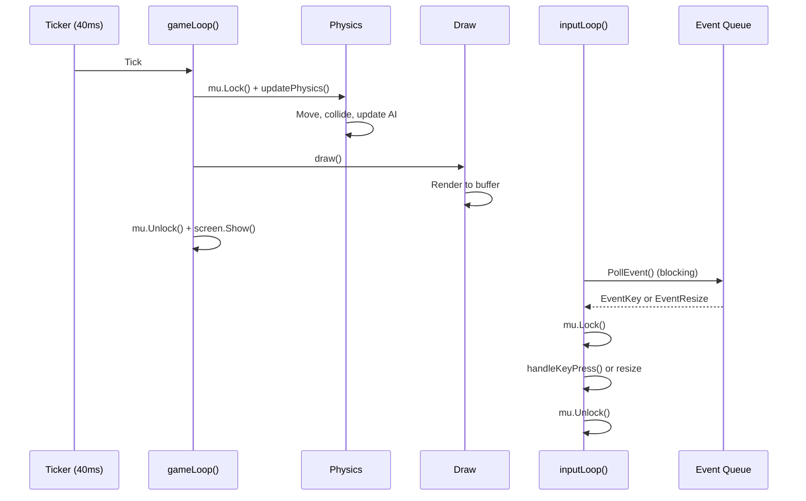

# Gobungle Implementation

This document details the code structure, module flow, and implementation specifics of the Gobungle engine.

## Module Overview

The codebase is organized using standard Go project layout:

**Entry Point:**
- **`cmd/gobungle/main.go`** (40 lines): Thin entry point. Initializes `tcell` screen, creates a game instance, and starts the run loop.

**Game Engine (`internal/game/`):**
- **`game.go`**: Core `Game` struct, `New()` constructor, `Run()` orchestrator, `gameLoop()` ticker, `inputLoop()` event handler.
- **`types.go`**: Entity types (`Helicopter`, `Boat`, `Carrier`, `Bullet`, `Missile`, `Factory`, `Drone`, `Tank`, `StaticAA`, `Island`, `Explosion`) plus direction vectors and sprite data.
- **`physics.go`**: Physics coordinator, helicopter dynamics, carrier defense, explosion aging, wave completion detection, and round reset logic.
- **`enemies.go`**: Enemy AI and movement (boats, factories with drones, patrolling tanks, static AA guns).
- **`projectiles.go`**: Bullet and missile movement, homing logic, boat CIWS interception mechanics.
- **`collision.go`**: All collision detection subsystems (projectiles vs entities, drones vs missiles, manual interception, CIWS defense).
- **`input.go`**: Keyboard handling (`handleKeyPress()`), target lock-on calculation (`getLockedTarget()`).
- **`draw.go`**: Full rendering pipeline (terrain, entities, projectiles, HUD).

## Code Module Flow

```mermaid
graph TB
    Main["cmd/gobungle/main.go<br/>(tcell init)"]
    Main -->|New| Game["game.New()"]
    Main -->|Run| Run["g.Run()"]
    
    Run -->|gameLoop 25 FPS| Physics["updatePhysics()<br/>(coordinator)"]
    Run -->|inputLoop async| Input["handleKeyPress()"]
    Run -->|gameLoop| Draw["draw()"]
    
    Physics -->|Sub-systems| Heli["updateHelicopter()"]
    Physics -->|Sub-systems| Enemy["updateBoats()<br/>updateLandForces()"]
    Physics -->|Sub-systems| Proj["updateProjectiles()"]
    Physics -->|Sub-systems| Collide["checkCollisions()"]
    Physics -->|Sub-systems| Wave["checkWaveCompletion()"]
    Physics -->|Sub-systems| Exp["updateExplosions()"]
    
    Input -->|getLockedTarget()| Game
    Draw -->|read Game state| Game
```

## Implementation Details

### 1. The Game Loop
The game uses a strict `40ms` ticker (`time.NewTicker`) in `gameLoop()` to maintain a consistent 25 FPS. The main `Run()` method:
1. Spawns `gameLoop()` as a background goroutine.
2. Blocks on `inputLoop()` to poll for user events.

Each tick orchestrates two phases under a mutex:
- **Update State**: `updatePhysics()` moves objects, resolves collisions, and manages AI.
- **Render State**: `draw()` syncs the current state to the `tcell` screen.

### 2. Physics System (`physics.go`)
The `updatePhysics()` function is a lightweight coordinator that calls subsystems in sequence:

```go
func (g *Game) updatePhysics() {
    g.Ticks++
    g.updateHelicopter()        // Flight dynamics, fuel, landing
    g.updateWeaponCooldowns()   // Weapon timers
    g.updateCarrierDefense()    // Automated carrier SSM firing
    g.updateProjectiles()       // Bullets and missiles (homing, range)
    g.updateBoats()             // Enemy boat AI and AA fire
    g.updateLandForces()        // Factories, drones, tanks, static AA
    g.updateExplosions()        // Particle aging
    g.checkCollisions()         // All hit detection
    g.checkWaveCompletion()     // Respawn logic
    g.lockedBoat, ... = g.getLockedTarget()  // Cache lock-on target
}
```

**Key Mechanics:**
- **Helicopter Flight**: Euler integration (`position += velocity`). Velocity is updated by thrust along the current `Dir` heading (8 cardinal directions). Drag of 0.99 (or 0.85 if out of fuel) provides smooth momentum decay.
- **Homing Missiles** (`projectiles.go`): Proportional navigation blends the missile's current velocity with the normalized vector to the nearest active target, accelerating up to a max speed.
- **Boat CIWS** (`projectiles.go`): 10% chance to fire a defensive anti-missile projectile when a player missile enters `BoatDetectionRange` (25 cells).
- **Wave Completion** (`physics.go`): When all boats, factories, and tanks are destroyed, enemies respawn with 1.25× speed scaling, creating progressive difficulty.

### 3. Collision Detection (`collision.go`)
All collision detection lives in `checkCollisions()`, which invokes specialized sub-methods:

- **Drone vs Missile Interceptions**: Factory drones shield factories from player missiles; carrier drones shield the carrier from enemy missiles. Proximity threshold: 4.0 cells.
- **Bullet Hitboxes**:
  - Boats: `|deltaX| < 5.5` and `|deltaY| < 1.5` (11×3 area).
  - Helicopter: `|deltaX| < 2.5` and `|deltaY| < 1.5` (5×3 area).
  - Drones: `|deltaX| < 1.5` and `|deltaY| < 1.2` (3×2 area).
  - Factories: `|deltaX| < 8.5` and `|deltaY| < 2.5` (17×5 area).
  - Tanks/Static AA: `|deltaX| < 2.5` and `|deltaY| < 1.5` (5×3 area).
- **Missile Hitboxes**: Same as bullets, targeting the nearest valid enemy within homing range.
- **Manual Interception**: Player bullets can intercept enemy missiles (`|deltaX| < 1.5` and `|deltaY| < 1.5`).
- **Missile Dodge**: Player missiles have a 35% chance to dodge enemy CIWS anti-missile fire.

### 4. Enemy AI (`enemies.go`)
- **Boats**: Patrol left/right, bounce off map edges. Fire AA at the helicopter within range (55 cells). Launch guided missiles at the carrier every 600–1000 ticks.
- **Factories**: Fire fortress AA projectiles at the heli (40–80 tick cooldown). Spawn replacement drones every 100 ticks if below 2 active drones (drawing from 8 reserve).
- **Drones**: Orbit their factory or the carrier at a fixed angle, wrapping around in a circular shield pattern.
- **Tanks**: Patrol vertical or horizontal paths. Fire flak at the heli (40–45 cell range, 50–90 tick cooldown).
- **Static AA**: Fixed coastal positions. Fire flak at the heli (45 cell range, 45–80 tick cooldown).

### 5. Input & Lock-On (`input.go`)
- **Flight Control**: Arrow keys or WASD for rotation/thrust, Down/S for air brakes, Space for cannon, F/M for guided missiles.
- **Target Lock-On** (`getLockedTarget()`): Searches for the nearest active healthy target within a +/– 45° forward aperture relative to the helicopter's heading. Checks boats, factories, tanks, and static AA in priority order by distance.
- **Landing**: L key triggers landing if aligned with the carrier pad (±1 cell) and speed is below 0.25 cells/tick. Auto-landing also triggers if hovering over the pad.

### 6. Rendering System (`draw.go`)
- **Sprite System**: The helicopter is a 5×3 rune array, with the center cell dynamically replaced by a rotor frame (spinning animation). Eight directions (0–7 = N, NE, E, SE, S, SW, W, NW).
- **Terrain**: Procedurally generated coastline using trigonometric waves. Road overlays (vertical and horizontal) on the island.
- **Carrier Smoke**: Billowing smoke columns that scale with damage level (0–100 HP). Thicker, faster smoke when heavily damaged.
- **Layering** (bottom to top):
  1. Ocean (waves) & island terrain (sand, grass, roads)
  2. Aircraft carrier deck with landing pad
  3. Enemy vessels (boats, factories, tanks, static AA)
  4. Projectiles (bullets, missiles)
  5. Explosions
  6. Helicopter
  7. HUD (instruments, status, controls)
- **HUD**: Real-time display of speed (knots), heading (degrees + cardinal), altitude (feet), fuel (%), missiles (visual count), flight status, landing alignment, boat count, armor (%), target lock, and carrier health bar.

### 7. Tcell Terminal Engine
The `game` package never directly calls `tcell.NewScreen()` or `Fini()`. The entry point in `cmd/gobungle/main.go` owns the screen lifecycle:

```go
s, err := tcell.NewScreen()
s.Init()
defer s.Fini()
g := game.New(s)
g.Run()
```

**Rendering Pipeline:**
- **Double Buffering**: Each frame writes to an internal `tcell` buffer via `SetContent(x, y, rune, nil, style)`, then calls `Show()` to flush to the terminal atomically.
- **Styles & Colors**: The `getMapStyle()` function calculates background colors dynamically based on terrain type (ocean, sand, grass, road, carrier). Sprites blend their foreground color onto the calculated background.
- **Event Handling**:
  - `inputLoop()` blocks on `PollEvent()`, capturing `EventKey` (flight commands) and `EventResize` (terminal size changes).
  - All screen mutations and input processing are guarded by `mu.Lock()` to synchronize with the physics ticker.

### 8. Tick Synchronization
The 25 FPS physics loop and blocking input loop run concurrently:



The mutex ensures that physics updates and input events never race, and that the screen is only rendered after all state changes are complete.
