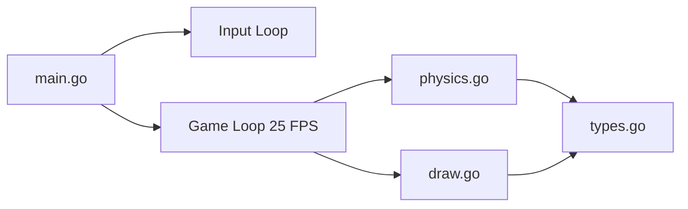
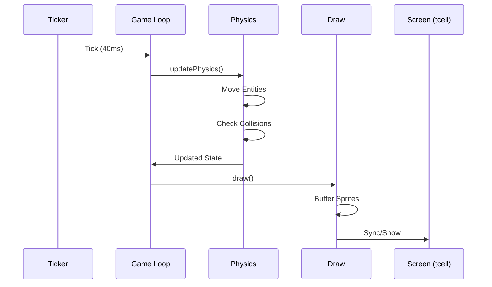

# Gobungle Implementation

This document details the code structure, module flow, and implementation specifics of the Gobungle engine.

## Module Overview

The codebase is organized into five primary Go files, each handling a specific domain:

- **`types.go`**: Centralized definitions for all game entities (`Helicopter`, `Boat`, `Carrier`, `Bullet`, `Missile`, `Game`).
- **`main.go`**: Entry point. Handles `tcell` initialization, the master game loop, and input event polling.
- **`physics.go`**: The core logic engine. Updates entity positions, handles collisions, homing logic, and AI behavior.
- **`draw.go`**: Rendering logic. Converts game state into characters and colors on the terminal screen.
- **`go.mod/sum`**: Dependency management.

## Code Module Flow

## Implementation Details

### 1. The Game Loop
The game uses a strict `40ms` ticker (`time.NewTicker`) to maintain a consistent 25 FPS. This loop resides in `main.go` and orchestrates the two-step phase:
1.  **Update State**: Calls `updatePhysics()` to move objects and resolve collisions.
2.  **Render State**: Calls `draw()` to push the current state to the `tcell` screen.

### 2. Physics & Collision Logic (`physics.go`)
- **Movement**: Uses Euler integration (`position += velocity`). `VX` and `VY` are updated based on rotation (`dx`, `dy` vectors) and thrust.
- **Homing Missiles**: Implements proportional navigation. The missile's velocity vector is blended with the normalized vector to the target every tick.
- **Collisions**:
  - **Boat Hitbox**: `math.Abs(deltaX) < 5.5` and `math.Abs(deltaY) < 1.5` (representing an 11x3 area).
  - **Heli Hitbox**: `math.Abs(deltaX) < 1.5` and `math.Abs(deltaY) < 1.5` (representing a 3x3 area).
- **Manual Interception**: Players can shoot down enemy missiles by firing their cannon directly at them.

### 3. Rendering System (`draw.go`)
- **Sprite System**: The helicopter uses a 3x3 rune array that rotates based on the `Dir` index (0-7).
- **Layering**:
  1. Water/Terrain (Bottom)
  2. Carrier & Boats
  3. Projectiles & Explosions
  4. Helicopter
  5. HUD/UI (Top)
- **HUD**: Displays real-time stats (Fuel, Armor, Ammo, Carrier Health) using `tcell` style coloring.

### 4. Data Flow
The `Game` struct acts as a singleton hub. All logic functions are methods of `*Game`, allowing unified access to entities and the `tcell` screen buffer.

