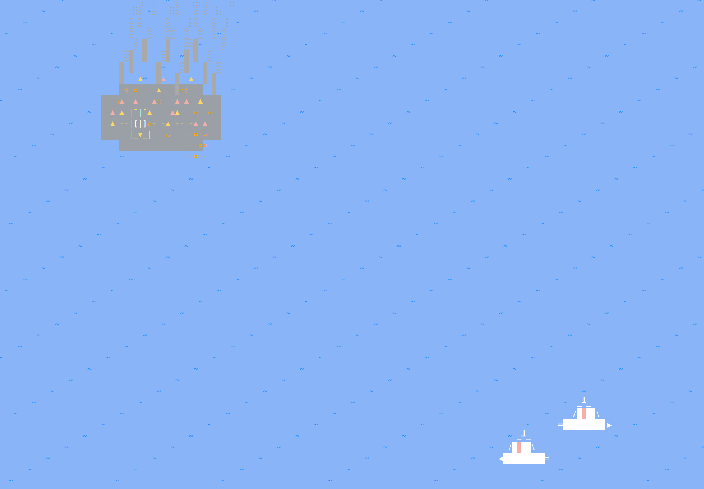

# 🚁 Gobungle: Tactical Helicopter Combat & Carrier Defense

Gobungle is a terminal-based tactical combat game written in Go using the `tcell` library. 

Command a state-of-the-art attack helicopter, defend your mothership aircraft carrier against rogue warships, and execute surgical lock-on guided missile strikes!

Inspired by Will Wright's legendary 1984 8-bit classic [Raid on Bungeling Bay](https://en.wikipedia.org/wiki/Raid_on_Bungeling_Bay), Gobungle adapts the iconic helicopter carrier defense formula into a fast-paced command line experience.

[](https://www.youtube.com/watch?v=teWJkLaut9s)


---

## 🎮 Gameplay & Mechanics

Your mission is to seek out and destroy three heavily armed rogue gunboats patrolling the ocean and the **fortress factory island**, while protecting your home aircraft carrier.

### 🎥 Scrolling World & Camera System
* **Expanded Playfield**: The game world is larger than your terminal window (2x width and 2x height), providing a vast theater of operations.
* **Dynamic Camera**: A sophisticated "dead-zone" camera system follows your helicopter as you fly. The camera stays centered on your aircraft but allows for minor movement before scrolling, ensuring you always have a clear view of the surrounding airspace and terrain.
* **World Boundaries**: The world is bounded, and the camera automatically clamps to the edges of the map, preventing you from flying into the "void".

### ⚓ The Aircraft Carrier (Mothership)
* **Your Safe Haven**: The carrier is marked by a yellow deck with an **`H`** landing pad. 
* **Replenishment**: Landing on the carrier pad slowly **refuels** your helicopter, **repairs** your armor, **re-arms** your guided missiles (up to 4 capacity), **repairs the carrier's own health**, and slowly **replenishes the carrier's defensive orbiting drones** (up to 2 concurrent drones).
* **Defend at All Costs**: Active enemy gunboats periodically launch powerful guided missiles targeting the center of your carrier deck. If the carrier's health drops to 0%, the round is lost and reset.
* **Carrier Defense Drones**: The carrier is equipped with **2 active defensive drones** orbiting the carrier. They act as a close-in defense shield, intercepting incoming enemy guided missiles in mid-air and sacrificing themselves to protect your mothership. When lost, they can be slowly rebuilt by landing on the carrier deck (1 drone every 100 ticks).
* **Advanced Respawn Logistics**: If your helicopter is shot down, a multi-second recovery sequence begins. You'll see secondary explosions at the crash site before the camera automatically re-centers on the carrier's landing pad, where a fresh aircraft is prepped for immediate takeoff. Any incoming missiles currently targeting the carrier will extend this respawn delay, simulating the tactical difficulty of a hot-zone extraction.

### 🏝️ The Enemy Bay Coastline & 3 Military Factories
* **Bay Coastline Landmass**: Replaces the single middle-right island with a massive, procedurally generated coastline wrapping the playfield on the North, East, and South. A 3-cell sandy beach frames the shoreline, transitioning into a lush, grassy interior.
* **Three Strategic Factories**: There are **3 independent military factories** distributed across the coastland (at Northern, Eastern, and Southern sectors). Each factory has its own health pool (15 HP), unique warning beacons flashing dynamically out of phase, and independent dual industrial smokestacks billowing smoke.
* **Fortress Flak AA**: Each active factory actively defends itself by firing periodic long-range anti-aircraft flak projectiles at the helicopter, making coastal penetrations highly tactical.
* **Sinking & Burning Sequence**: When any factory's HP is reduced to 0, it enters a 45-tick delayed burning destruction phase, where fire base flame characters (`▲`, `☼`) flicker on its structure and generate thick ash smoke, followed by a final massive shockwave explosion.

### 🛡️ Air Defense Drones (Guided Missile Hard-Counter)
* **Trigonometric Orbit**: Two active air-defense drones (`⌖` in bright LightCyan) constantly orbit *each active factory* (up to 6 drones active simultaneously), bound directly to their parent facility's power grid.
* **Interception Hard-Counter**: If you fire a guided missile, the drones orbiting near your target will detect and intercept it, neutralizing the missile in mid-air in a mutual explosion!
* **The Tactical Puzzle**: To damage any factory with your guided missiles, you must first use your manual high-velocity cannon to destroy its specific protective orbiting air-defense drones, opening a temporary window of opportunity before the facility is destroyed or reset.
* **Depletable Shield Pool**: Each factory starts with 2 active drones and a reserve of 8 more (for a **maximum pool of 10 defense drones per factory**). You can deplete a factory's defenses permanently for that wave by shooting down all 10 drones (either using your cannon or by letting them intercept your missiles). Once all 10 drones are destroyed, the factory's shields are fully down, leaving it completely vulnerable to guided missiles! The Cockpit HUD's target locking system displays live status updates (`FACTORY (DRONES: X/10)` or `FACTORY (SHIELDS DOWN!)`) to aid your tactical planning.

### 💨 Dynamic Billowing Smoke & Inferno State
The visual state of your carrier dynamically reflects its health (0% - 100%):
* **Granular Fire Outbreaks**: Up to **12 unique deck sources** ignite one by one as the ship takes damage.
* **Plume Height & Density**: Plumes rise organically up to **17 cells high**. As health deteriorates, smoke thickens from sparse grey ash (`░`) to dense black pillars (`█`).
* **Convection Rates**: Under minor damage, smoke lazily drifts upwards. When the ship is critically damaged, the convection rate doubles, sending smoke billowing furiously.
* **Flickering Fire Base**: Active deck fires flicker at the base of each smoke column, cycling rapidly through Red, Orange, and Yellow flames (`▲`, `☼`).
* **Horizontal Wind Curling**: Plumes swirl and wiggle horizontally (`math.Sin`) as they drift Eastward under oceanic wind conditions.

### ⚔️ Combat & Interception
* **Aerial Cannons**: Your high-velocity cannon bullets fly up to a range of 35 cells. Use them to shred gunboats, destroy air-defense drones, or **manually intercept and shoot down incoming enemy guided missiles** in mid-air to protect your carrier!
* **Guided Missiles**: Fire high-impact guided missiles at locked gunboats or the factory. Targets must be within a ±45-degree forward field-of-view aperture. Fired missiles start at speed 0.5 and accelerate up to speed 5.0, tracking their targets continuously.
* **Enemy Anti-Air (AA)**: Gunboats defend themselves with rapid-fire standard AA flak (range 55) and launch guided missiles directly targeting your carrier's flight deck.

---

## ⌨️ Controls & Keybindings

| Key / Action | Control (Keyboard) | Alternative (WASD) |
| :--- | :--- | :--- |
| **Move / Accelerate Forward** | `Up Arrow` | `W` / `w` |
| **Air Brakes (Dampen Speed)** | `Down Arrow` | `S` / `s` |
| **Rotate Counterclockwise** | `Left Arrow` | `A` / `a` |
| **Rotate Clockwise** | `Right Arrow` | `D` / `d` |
| **Take Off (from Carrier Pad)**| `Space` / `Up Arrow` / `L` | `W` / `w` |
| **Land (over Carrier Pad)** | `L` (when aligned & hovering slowly) | `l` |
| **Fire Aerial Cannon** | `Spacebar` | `Spacebar` |
| **Fire Guided Missile** | `F` / `f` / `M` / `m` | `F` / `f` / `M` / `m` |
| **Graceful Quit Game** | `Escape` or `Ctrl+C` | `Escape` or `Ctrl+C` |

---

## 🛠️ Installation & Building

### Prerequisites
* [Go](https://go.dev/doc/install) 1.20 or newer installed.
* A terminal supporting 256 colors or true color (e.g., standard Linux/macOS terminal).

#### Linux Dependencies

The audio library requires `pkg-config` and ALSA development headers. Install them before building:

**Debian / Ubuntu:**
```bash
sudo apt-get install pkg-config libasound2-dev
```

**Fedora / RHEL / CentOS:**
```bash
sudo dnf install pkgconfig alsa-lib-devel
```

**Arch Linux:**
```bash
sudo pacman -S pkgconf alsa-lib
```

### Compiling and Running
1. Clone or navigate to the repository directory:
   ```bash
   cd gobungle
   ```
2. Build the executable using the provided `Makefile`:
   ```bash
   make build
   ```
3. Run the game:
   ```bash
   ./gobungle
   ```

---

## 🖥️ Cockpit HUD Display

Your helicopter features an advanced real-time heads-up display split at the bottom of the screen:
```text
CARRIER: [████████░░] 75%  |  ARMOR: [██████████] 100%  |  FUEL: [██████████] 100%
GPS: (124, 45) | SPEED: 110 KTS | HEADING: 90° (E) | ALTITUDE: 450 FT | FUEL: [██████████]
⚠️ WARNING: INCOMING MISSILE ⚠️
```
* **Blinking HUD & Audio Warnings**: The dashboard flashes a bright red `⚠️ WARNING: INCOMING MISSILE ⚠️` alert and emits an audible "ping" whenever an active enemy missile is flying toward your carrier deck, giving you time to race back and intercept it!
* **GPS Telemetry**: The HUD now provides real-time GPS coordinates, essential for navigating the expanded scrolling world and locating strategic targets across the vast coastline.
* **Lock Telemetry**: The lock display is fully target-aware, showing `BOAT` or `FACTORY` when a target falls inside your seeker cone, confirming locking status before missile launch.
