# Gobungle Code Path Diagrams

Visual companion to [IMPL.md](./IMPL.md). Each Mermaid diagram traces an actual
control-flow path through the `internal/game` package. File/function references
are accurate as of the `scrolling` branch.

---

## 1. Threading Model & Top-Level Loop

Two goroutines share all state behind a single mutex (`g.mu`). The render/physics
loop is driven by a 40 ms ticker (25 FPS); the input loop blocks on tcell event
polling. Both acquire the lock before touching game state.

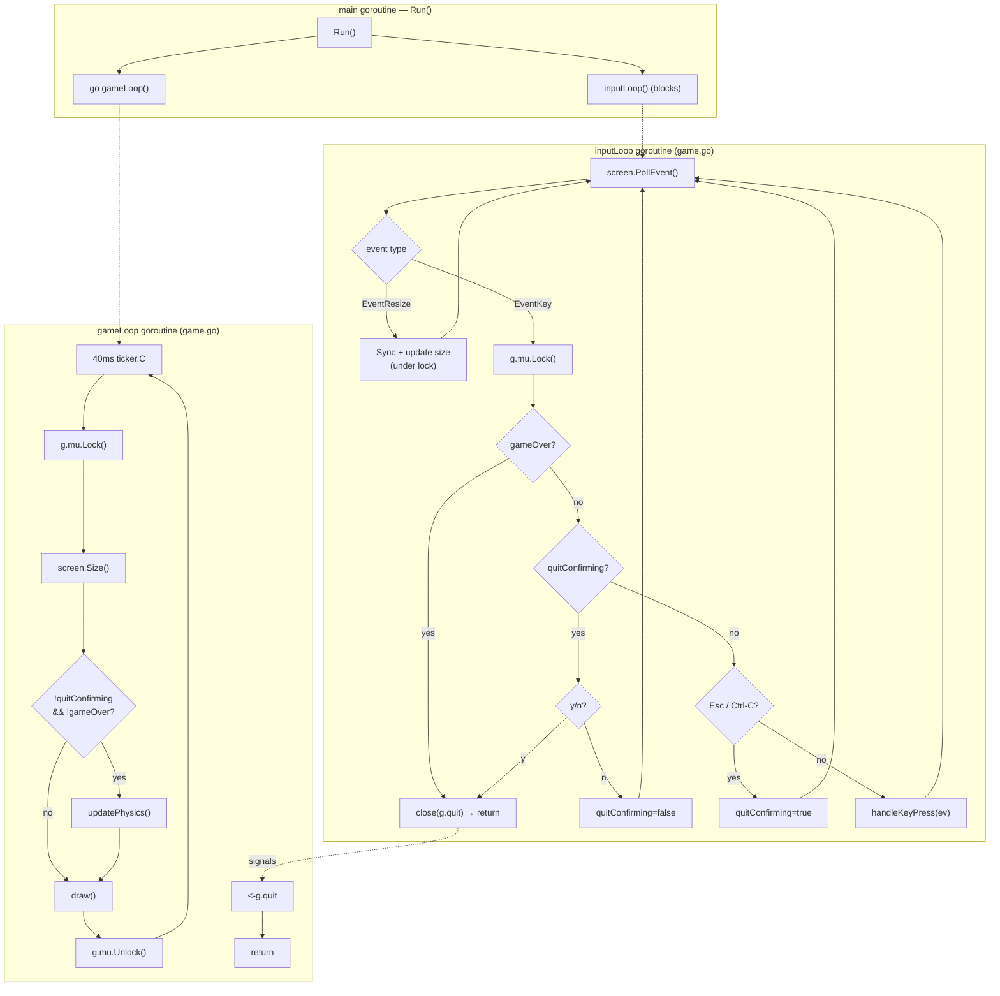

---

## 2. Physics Update Pipeline — `updatePhysics()`

Called once per tick. The order matters: cooldowns and movement update before
collisions are resolved, and target lock is computed last so the HUD and the next
input frame see a fresh lock.

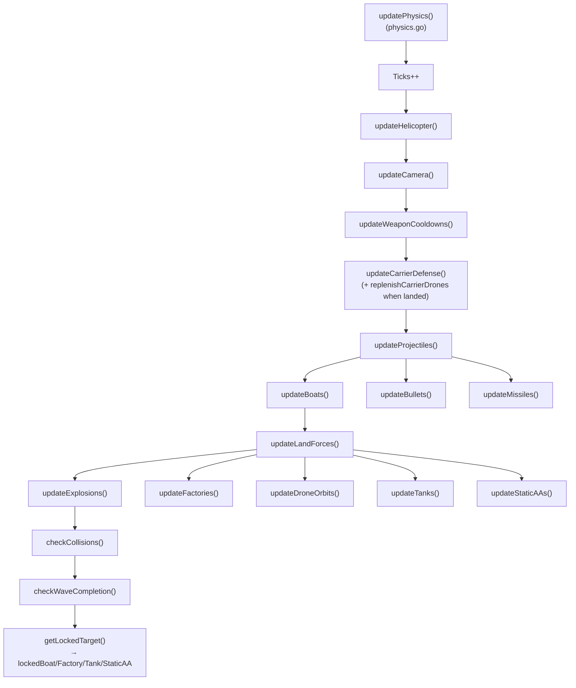

---

## 3. Helicopter State Machine — `updateHelicopter()`

The helicopter lives in one of three states. Transitions are driven by fuel,
collisions (which set `RespawnTimer`/`Armor`), and proximity to the carrier pad.

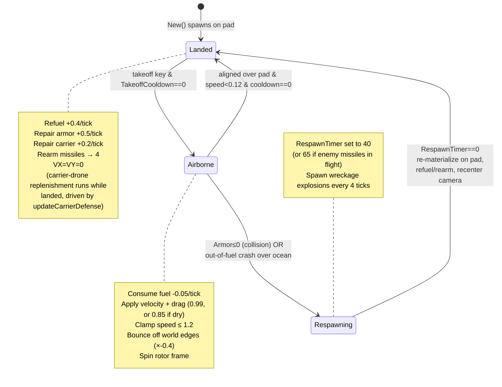

---

## 4. Player Input Routing — `handleKeyPress()`

Input is gated by helicopter state. A destroyed or respawning heli ignores all
keys; a landed heli only accepts takeoff; an airborne heli accepts steering,
thrust, cannon, and guided-missile commands.

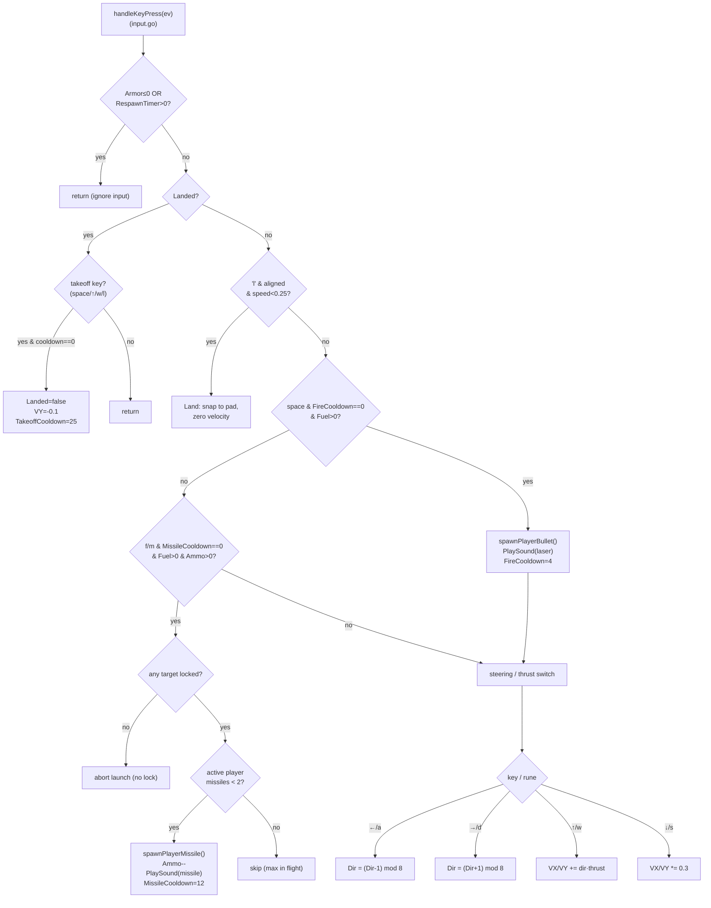

---

## 5. Target Lock Acquisition — `getLockedTarget()`

Each tick, scans every enemy class for the nearest active target inside the
`±45°` forward aperture (`dot ≥ 0.707`) and within `MaxLockOnRange` (100 units).
Y deltas are doubled to correct for terminal cell aspect ratio. Only one target
is locked — the last writer wins, so the global nearest survives.

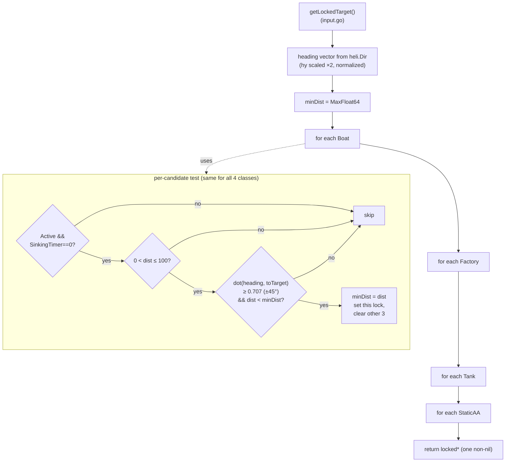

---

## 6. Collision Dispatch — `checkCollisions()`

Five sub-checks run in sequence. Drone interceptions run first (so a shielded
missile dies before it can hit anything), then bullets, then missiles, then the
two mutual bullet-vs-missile interception passes.

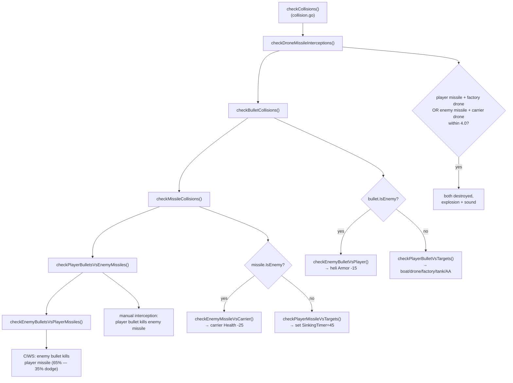

### 6a. Player bullet damage resolution — `checkPlayerBulletVsTargets()`

Targets are tested in a fixed priority order; the first hit consumes the bullet
(`return`). Boats and factories take incremental damage; reaching 0 HP triggers
the delayed sinking sequence (factory/tank/AA) or immediate sink (boat by cannon).

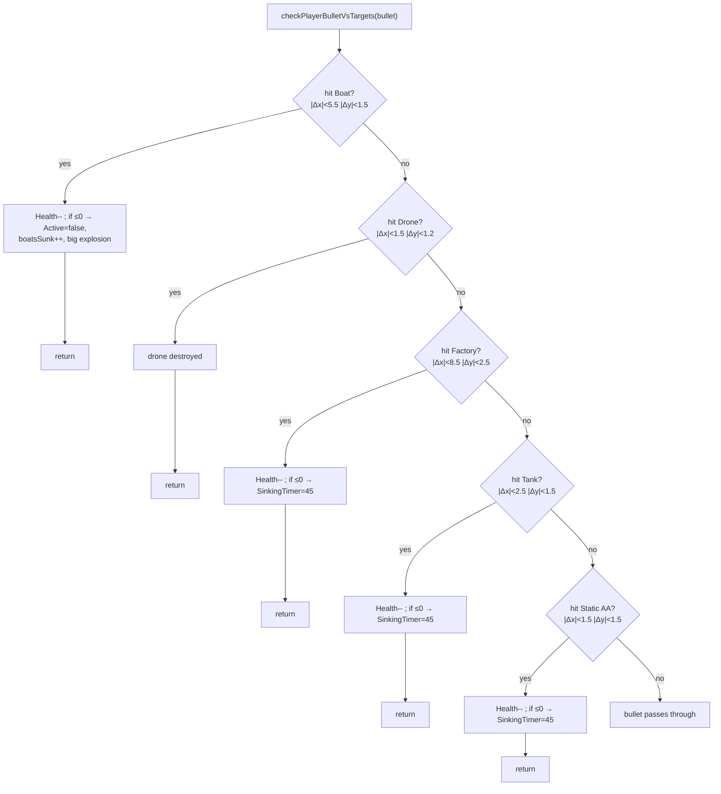

---

## 7. Projectile Lifecycle

Bullets and missiles share a pooled-slot allocator (`appendBullet`/`appendMissile`
reuse inactive slots before growing). Each tick they home (missiles only), move,
and self-cull on world-edge exit or max-range.

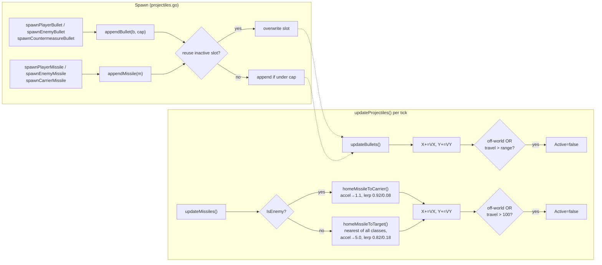

### 7a. Boat CIWS countermeasure (inside `homeMissileToTarget`)

When a player missile homing on a boat closes within `BoatDetectionRange` (25),
the boat rolls **once** (`InterceptionRolled`) for a 10% chance to fire a
countermeasure bullet back along the missile's bearing.

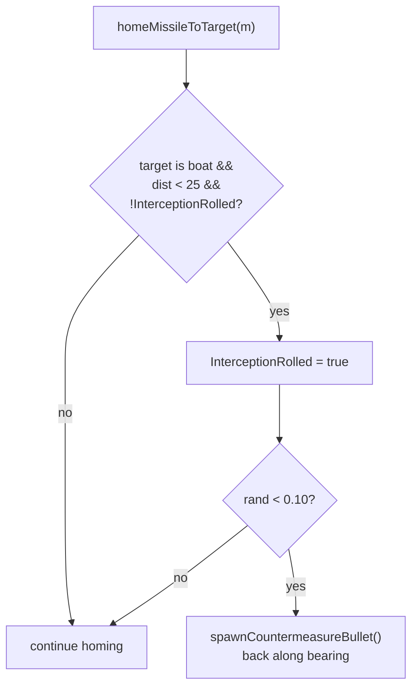

---

## 8. Wave Progression — `checkWaveCompletion()`

A wave ends only when **all** boats, factories, tanks, and static AAs are
inactive. The reset re-arms every asset with 1.25× speed and gates harder unit
classes behind wave thresholds.

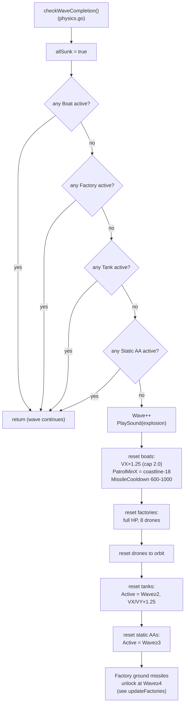

### 8a. Unit activation thresholds

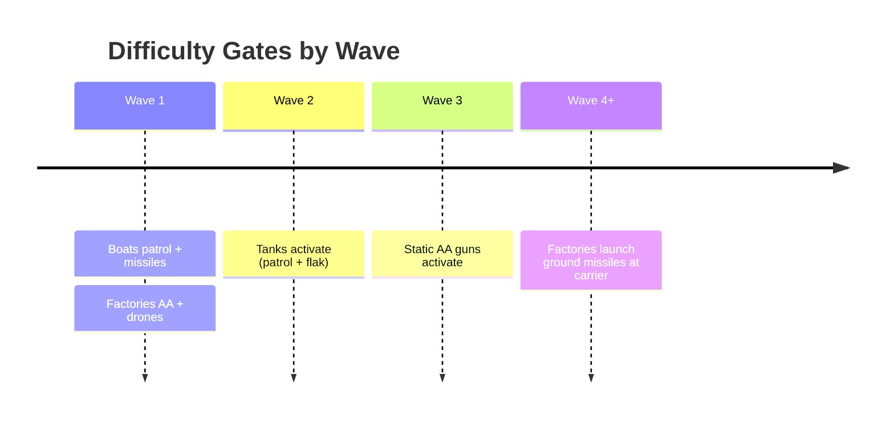

---

## 9. Carrier Destruction vs. Wave Reset

Two distinct "reset" paths exist and should not be confused:

- **`checkWaveCompletion()`** — player wins the wave; assets respawn *harder*.
- **`resetRound()`** — carrier health hits 0 mid-game; full round reset (called
  on carrier loss). Note the enemy-missile-vs-carrier path sets `gameOver = true`
  when health reaches 0, ending the session.

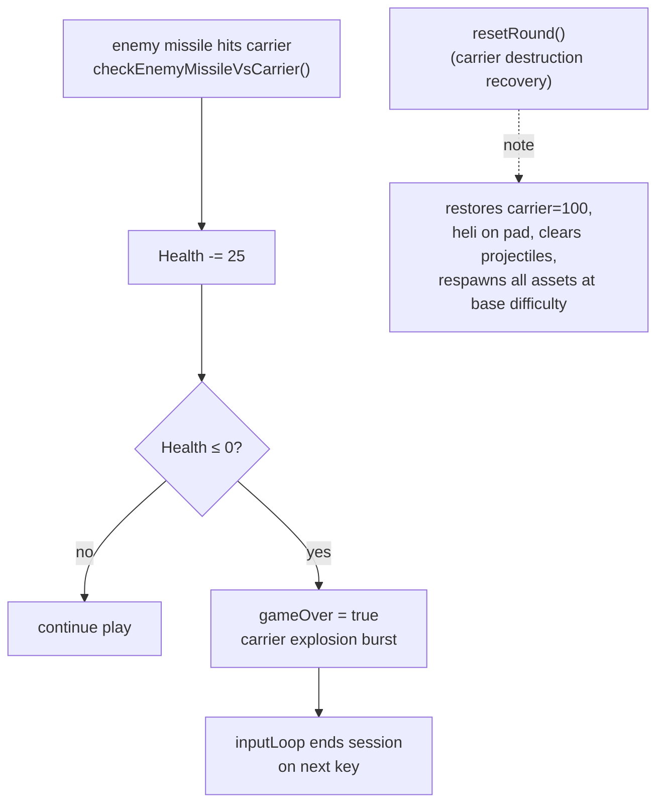

---

## Cross-Reference

| Concern | Entry point | File |
| --- | --- | --- |
| Loop & threading | `Run`, `gameLoop`, `inputLoop` | `game.go` |
| Per-tick orchestration | `updatePhysics` | `physics.go` |
| Player control | `handleKeyPress`, `getLockedTarget` | `input.go` |
| Enemy AI | `updateBoats`, `updateFactories`, `updateTanks`, `updateStaticAAs` | `enemies.go` |
| Projectiles | `updateProjectiles`, `spawn*`, `homeMissile*` | `projectiles.go` |
| Damage & interception | `checkCollisions` + sub-checks | `collision.go` |
| Rendering & HUD | `draw`, `drawHUD` | `draw.go` |
| Audio | `InitSound`, `PlaySound` | `sound.go` |
